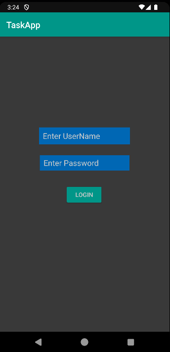
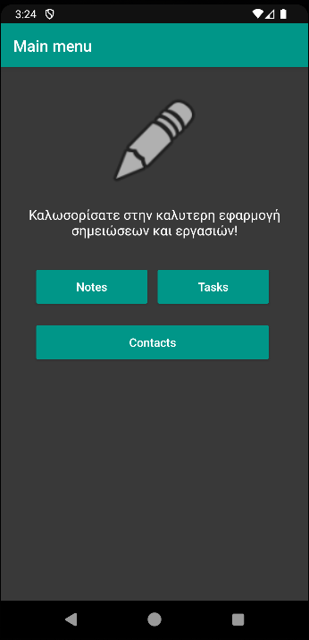
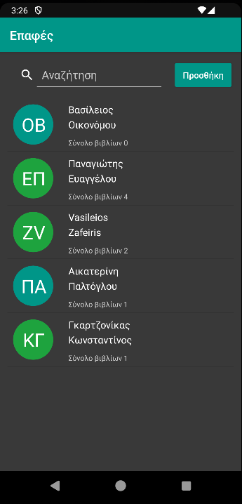
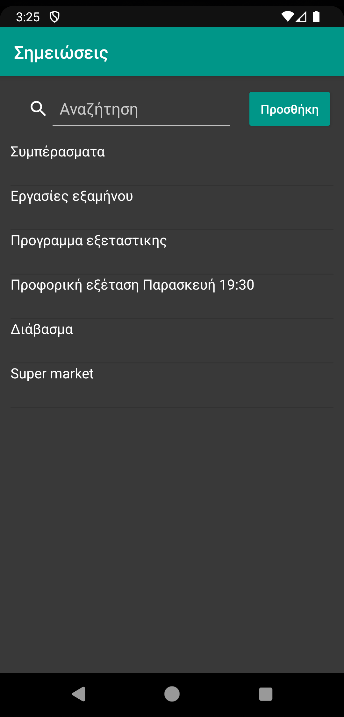
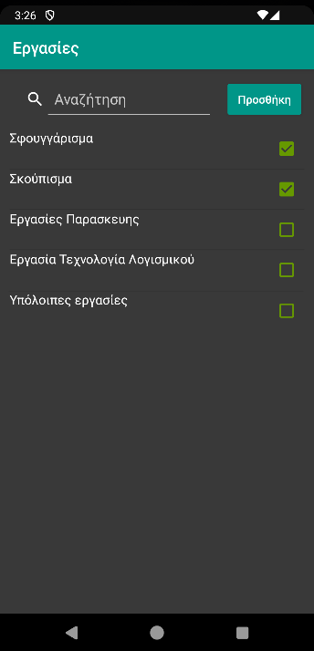

# Note-Task-Android-App

A simple app for taking notes, creating tasks and managing contacts.

The user interface has been implemented on Android. The oldest supported version is 5.0.

## Setting Up on Windows Environment

1. Install Android Studio if necessary (version 2.1.13 or newer is recommended). If you have a version older than 2.3.0, you will need an internet connection because Android Studio will automatically download the required software.

2. Set up the environment variable <code>ANDROID_HOME</code> by running the command line instruction <code>setx ANDROID_HOME C:\\Users\\%username%\\AppData\\Local\\Android\\sdk</code>. If you have installed the Android SDK in another folder, enter that one instead and make sure it exists. If it's missing during step 6 execution, an error message indicating the absence of the <code>ANDROID_HOME</code> environment variable will appear.

3. Install the Java JDK if necessary. If it's missing during step 6 execution, an error message indicating the absence of the <code>JAVA_HOME</code> environment variable will appear.

4. Accept the Android SDK licenses by running the command line instruction <code>"%ANDROID_HOME%/tools/bin/sdkmanager" --licenses</code> and pressing <code>y</code> on everything. If you haven't accepted them, executing step 6 will show an error message about "accepting the Android licenses".

5. Download the application code from GitHub and place it in a folder, extracting it if necessary.

Alternatively, from the initial screen of Android Studio, select "Open an existing Android Studio project" and open the project. Once the scripts running upon opening the project from the top menu are completed, we choose "Build -> Make Project". This compiles the code and runs automatic checks but does not produce reports or signed executables.

## Execution

The simplest way is to install the APK on your mobile device.

Alternatively, through Android Studio, the project execution occurs by selecting "Run -> Run 'app'" from the top menu. In order for the application to run, we need to have defined an emulator or connected an Android smartphone to our computer.

## Screenshots

